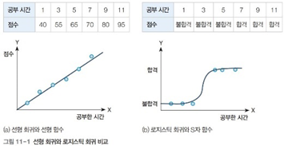
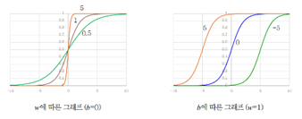
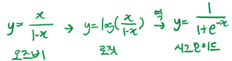
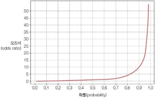
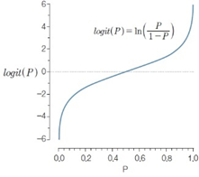
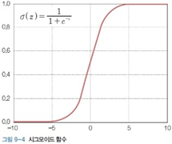
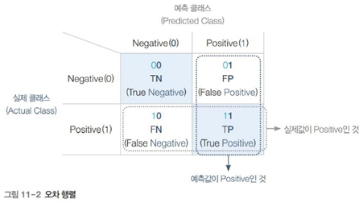
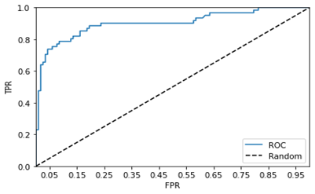
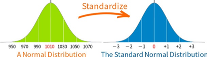

# 특징 데이터로 유방암 진단하기 
- 목표 : 유방암 특징을 측정한 데이터에 로지스틱 회귀 분석을 수행하여 유방암 발생을 예측
- 핵심개념 : 로지스틱 회귀, 시그모이드 함수, 성능평가 지표, 오차행렬, 정밀도, 재현율, F1스코어, ROC기반 AUC스코어
- 데이터준비 : 유방암진단 데이터 - 사이킷런 내장 데이터
- 분석모델 구축 : 사이킷런의 로지스틱 회귀모델 구축
- 결과분석 : 성능평가 지표 계산 - confusion_matrix, accuracy_score, precision_score, recall_score, f1_score, roc_auc_score

## 회귀분석과 로지스틱 회귀분석

### 회귀분석의 문제
- 종속변수가 두가지(=분류 문제)인 경우 회귀분석(OLS)의 적용과 해석의 문제 발생
- 공부시간 2시간이 증가할때 합격확률이 xx%증가 한다?
- 상한선 또는 하한선을 넘는 수치 발생
- 우리의 목표 : 오차가 적은 선형그래프 만들기
- 꾸부러진 곡선인 로지스틱 회귀 쓰면 오차율이 더 적어진다. 


### 로지스틱 회귀
- 회귀분석 : 분류에 사용하는 기법으로 선형 회귀와 달리 S자 함수를 사용하여 참(True, 1)과 거짓(False, 0)을 분류
- 오즈비(odds ratio) : 어떤 사건이 일어날 확률과 일어나지 않을 확률의 비율
- 어떤 사건이 일어날 확률은 P(X), 일어나지 않을 확률 1 - P(x)로 나타냄 (0 ≤ P(X) ≤ 1)
- 따라서 오즈비는 (0 ≤ odds ratio ≤ ∞)
- 확률자체는 0과 1 사이의 값으로 제한되어 있어서 선형회귀로 표현하기에 적합하지 않음 → 그래서 오즈비를 이용
- 근데 문제가 있음. 0에서 무한대까지 가버린다. → 해결방법은 로그를 씌우면 됨. → "오즈비에 로그 씌운게 로짓함수"

### 로짓 함수
- 오즈비에 상용로그를 붙인 수식 (아직까지 노쓸모)
- logit(P) 는 (-∞ ≤ logit(P) ≤ ∞) 

### 시그모이드 함수
- 로짓함수의 역함수. 로지스틱 회귀에서 사용하는 S자함수
- x의 값이 커지면 y의 값은 1에 근사하게 되고 x의 값이 작아지면 y의 값은 0에 근사하게 되어 S자 형태의 그래프가 됨
- 두 개의 값을 분류하는 이진 분류에 많이 사용
- 로짓에 역함수(y=x 대칭) 취하니까 쓸만해지더라! 파라미터를 조정하면 S자함수가 됨.
- 파라미터를 잘 조정하면 어떤 상태가 일어날 확률의 오차를 줄일 수 있음
- 회귀함수에서는 a와 b를 고쳤다면, 로지스틱회귀에서는 w값과 b값을 조정해서 오차가 적게끔 구현
- 파이썬에 다 알고리즘이 있기 때문에 데이터 넣어주면 파이썬이 잘 예측해줌


### 전체적인 과정 정리
- 오즈비 → 로짓 → 시그모이드
 <br>

 <br>

 <br>

 <br>

## 로지스틱 회귀와 오차행렬

### 로지스틱 회귀
- 선형 회귀 모델은 실제값과 예측값의 오차에 기반한 지표를 사용
- 로지스틱 회귀 모델은 이진 분류 결과를 평가하기 위해 오차 행렬에 기반한 성능 지표인 정밀도, 재현율, F1 스코어, ROC_AUC를 사용

### 오차행렬 
- 행렬을 사용해 이진 분류의 예측 오류를 나타내는 지표
- 행은 실제 클래스의 Negative/Positive 값
- 열은 예측 클래스의 Negative/ Positive 
- 정확도는 제일 높은게 1. 1에 가까울수록 정확함.
- 사이킷런에서는 오차 행렬을 구하기 위해 confusion_matrix 함수를 제공
```
TN: Negative가 참인 경우	TP: Positive가 참인 경우
FN: Negative가 거짓인 경우	FP: Positive가 거짓인 경우
```
 <br>

### 정밀도
- 예측이 Positive인 것(FP+TP) 중에서, 참인 것(TP)의 비율을 의미(예: 스팸메일)
- 정밀도는 Positive 예측 성능을 더 정밀하게 평가하기 위한 지표로 사용
* 좀 틀리게 추출해도 추출내용은 확실하게 맞는거만. 
* 암환자경우와 다르게, 스팸인지 아닌지 애매하면 그냥 정상메일로 쳐줌 > TP가 높아짐
- 사이킷런에서는 정밀도를 구하기 위해 precision_score 함수를 제공

### 재현율(TPR)
- 실제값이 Positive인 것(FN+TP) 중에서 참인 것(TP)의 비율을 의미(예: 암환자) 
- 실제 Positive인 데이터를 정확히 예측했는지 평가하는 지표 (민감도 또는 TPR)
* 예측값중 positive는 암진단 받은사람 / negative는 암 아니라고 진단받은 사람 > 실제로 다를 수 있음
* TN(실제 건강사람인데, 예측결과 암 아니라고 나옴), FP(건강사람인데, 예측결과 암이라고 나옴)
    * 암환자 예측시, 암환자인지 아닌지 헷갈릴때는 그냥 암환자라고 침. 암환자들을 최대한 많이 포함시키는게 중요함
    * 애매모호한 경우, 시스템이 ‘나 잘 모르겠어’ > 그냥 다 암환자로 쳐라 > 그러면 TP가 엄청 높아짐 > 재현율 높아짐 (재현율 높아야함)
- 사이킷런에서는 재현율을 구하기 위해 recall_score 함수를 제공

### F1 score
- 정밀도와 재현율을 결합한 평가 지표
- 정밀도와 재현율이 한쪽으로 치우치지 않을 때 상대적으로 높은 수치가 나온다. 치우치면 훅 줄어듦.
- 정밀도와 재현율이 서로 트레이드 오프 관계(상충 관계)인 문제점을 고려하여 정확한 평가를 위해 많이 사용
- 상충관계 : 기준값을 세밀하게 두면 정밀도가 높아지고 둔감하게 만들면 재현율이 높아짐 (예) 전부 암환자로 진단하면 재현율이 높음
- 사이킷런에서는 F1 스코어를 구하기 위해 f1_score 함수를 제공
- 정밀도와 재현율
    - 정밀도와 재현율은 비슷한 개념, 반대의 상황
    - 정밀도만 쓰거나 재혈율만 쓰는 논문은 쓰면 안됨. 둘다 써야한다. > F1스코어 쓰기.

### ROC 기반의 AUC 스코어
- 오차 행렬의 FPR이 변할 때 TPR이 어떻게 변하는지를 나타내는 곡선 및 면적의 크기 : 최대 1인 결과 값을 가짐
    -  TPR: 실제 Positive인 데이터를 Positive로 참True으로 예측한 비율 (ex: 암환자를 암이라고 진단. 높을수록 좋음)
    - FPR: 실제 Negative인 데이터를 Positive로 잘못 예측한 비율 (ex : 정상환자를 암이라고 진단)
- 정상환자를 암이라고 오진하지 않을수록 TPR은 떨어진다. 어떤 상황이더라도 TPR이 높은게 우수.
- 거짓 양성 비율(FPR)의 변화에 따른 진짜 양성 비율(TPR)을 그래프로 나타냄
- ROC 기반의 AUC 값은 ROC 곡선 밑의 면적을 구한 것으로 1에 가까울수록 좋은 성능을 의미 (그래프 전체면적이 1)
 <br>

## 표준 정규분포 하는 이유
- 기존데이터는 어떤건 cm, 어떤건mm, 어떤건 좌표로 들어감 > 열마다 데이터셋의 단위가 좀 다르다. 숫자의 단위와 크기가 가지각색
- 이렇게 잘 모르겠고, 일단 정규분포의 느낌을 가지는 그래프이면 fit_transform을 해준다.
- 자연데이터는 기본적으로 정규분포를 따르기에 fit_transform해주었다.
- 정규분포는 중심이 꼭 0이어야 하고, 이걸 해줘야 오작동 방지됨. 이걸 fir_transform이 알아서 맞춰줌.
- 데이터 전체를 정규분포화시킴. 그럼 사람이 보기 좀 더 편하게 결과가 나옴.

 <br>