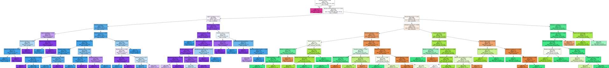
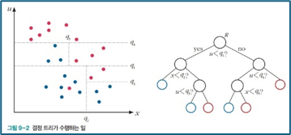
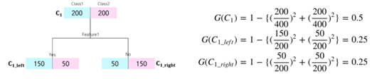
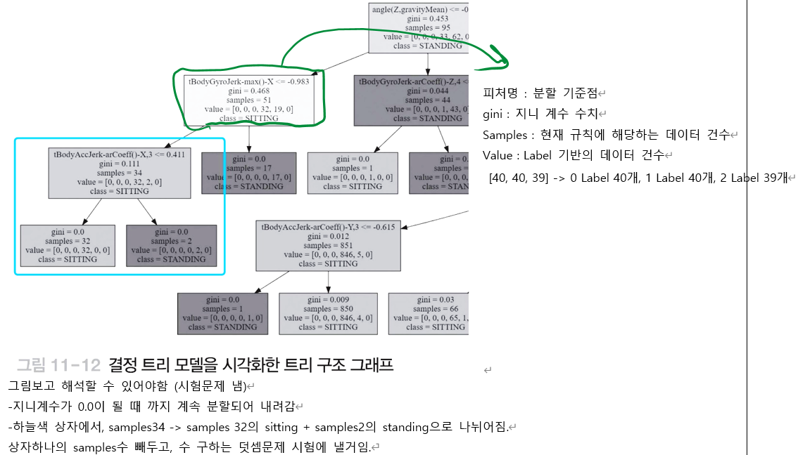

# 센서 데이터로 움직임 분류하기
- 목표 : 스마트폰에서 수집한 센서 데이터를 분석하여 사람의 움직임을 분류 하는 모델을 생성. 새로운 데이터에 대해 움직임 유형을 예측해서 분류
- 핵심개념 : 핵심개념 : 결정트리, 정보이득지수, 지니계수
- numpy, pandas, sklearn, seaborn, matplotlib, Graphviz 이용

## 결과 미리보기
  

## 분석의 전반적인 flow
- **데이터탐색**
    1. 피처이름파일을 로드하여 객체로 저장
    2. 훈련 데이터셋을 파일에서 로드하여 객체로 저장
    3. 평가 데이터셋을 파일에서 로드하여 객체로 저장
    4. 레이블 이름 파일을 로드하여 객체로 저장
- **분석모델 구축**
    - 사이킷런의 결정트리모델 구축 : 
    - 결정 트리 모델의 생성, 훈련, 예측
- **결과분석**
    1. 성능평가 지표 계산 : accuracy_score
    2. 결정트리의 하이퍼 매개변수 변경에 대한 정확도 분석
    3. 최적 결정트리 모델 생성 : GridSearchCV (패키지 결정트리 시각화에 사용하는 패키지. 다이어그램 그려줌)
    4. 중요 피처 분석 : feature_importances_

## 개념

### 결정트리
- 머신러닝 알고리즘 중에서 직관적으로 이해하기 쉬운 것으로 다중 분류에 많이 사용
- 데이터 안에서 if/else 기반으로 규칙을 찾아 학습하여 트리 구조의 분류 규칙을 만듬
- 결정 트리의 구조는 규칙 조건(if)을 나타내는 규칙 노드와 분류가 결정된 클래스 값이 표시된 리프 노드로 구성
- 데이터의 균일도를 계산하는 대표 적인 방법으로 정보 이득 지수와 지니 계수가 있음
- 트리는 몇단계까지 자를거냐, 무슨 함수로 잘라줄거냐 에 따라 다양한 방식이 존재 
- 결정트리에는 정보이득지수, 지니계수가 두가지 대표임. 
- 우리 실습은 지니계수로 할거임. 근데 정보이득지수도 많이 쓰이기에 개념알기

### 정보이득 지수
- 정보 이득은 엔트로피 개념을 기반으로 함. 엔트로피
- 즉 데이터 집합의 혼잡도를 의미
    - 데이터 집합에 다른 데이터 = 균일도가 떨어짐 → 혼잡도가 높아지므로 엔트로피가 높아짐
    - 데이터 집합에 같은 데이터 = 균일도가 높아짐 → 혼잡도가 떨어지므로 엔트로피가 낮아짐
- 정보 이득 지수: 혼잡도가 줄어들어 얻게 되는 이득을 의미하는 것으로, ‘1-엔트로피’로 계산
    - `정보 이득 지수는 높을수록 좋음(=균일하다!)`
- 결정 트리: 정보 이득 지수가 높은 피처를 분할 기준으로 사용

### 지니계수
- 소득의 불균형 정도를 나타내는 것인데 머신러닝에서 지니 계수는 데이터의 순도를 나타내기 위해 사용
- 결정 트리에서는 지니 계수가 높을수록 순도가 낮은 데이터 집합을 의미
- 지니 계수가 0이면 완전 순수한 데이터 집합을 의미
- `즉, 지니 계수는 낮을수록 좋음!`  

- 계산방법 잘 이해하기 : 그림에서 총 400개 중에
    - 위) 왼쪽 200, 오른쪽 200 -> 계산하면 0.5 (안좋음)
    - 좌, 우) 150, 50 이면 한쪾으로 몰렸으니까 비교적 순수함. 
    - = 계산하면 0.25 (좀더 순수해짐)
    - 가정) 완전히 한쪽으로 몰려서 순수하면 200, 0 이 나옴 = 계산하면 거의 0에 가까움 (완전 순수)

### DecisionTreeClassifie
- 사이킷런에서 제공하는 결정트리 분류모델임. 주요 매개변수 소개
- min_samples_split : 노드를 분할하기 위한 최소 샘플 데이터 개수 (defalut : 2)
- min_samples_leaf : 리프 노드가 되기 위한 최소 샘플 데이터 개수
- max_features : 최적의 분할을 위해 고려할 최대 피처 개수
    * none ; 모든 피처 사용 / int : 사용할 피처 개수 설정 / float : 사용할 피처개수를 퍼센트로 설정 / sqrt : 전체피처개수의 루트씌워 설정
- max_depth : 트리의 최대 깊이
- max_leaf_nodes : 리프 노드에 들어가는 샘플 데이터의 최대 개수

## 데이터 준비
- 센서데이터
- UCI machine learning repository에서 다운로드

## 트리 결과 해석
- < 시각화된 트리 그래프를 보면 561개 피처를 사용하여 depth가 8인 결정 트리를 작성한 것을 확인>

  
