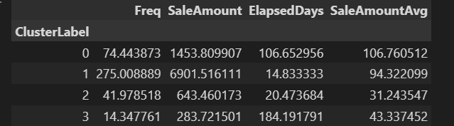
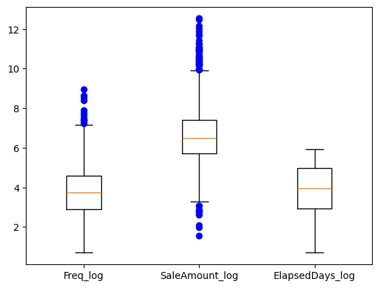
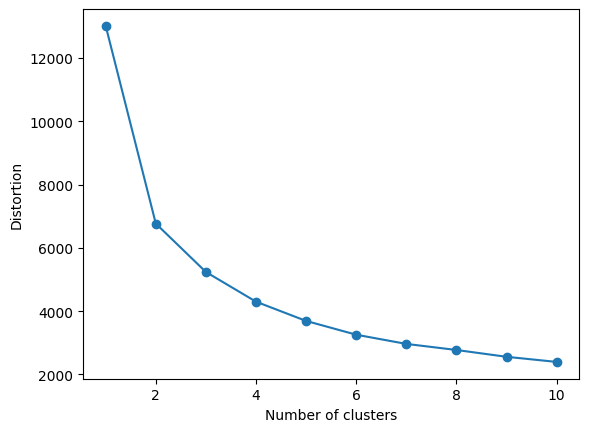
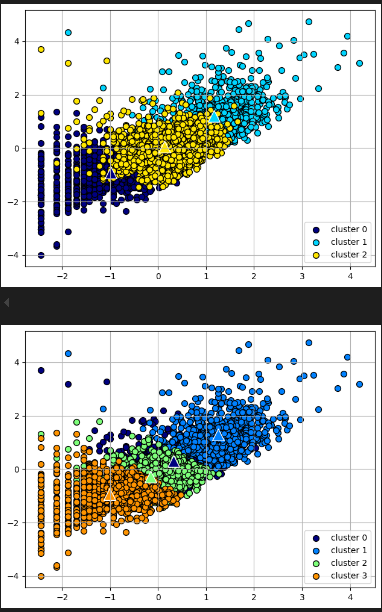
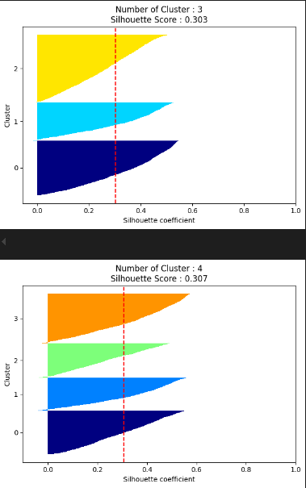
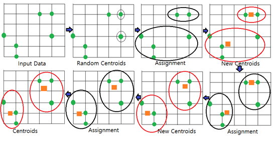
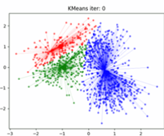
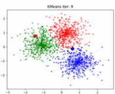

# 타깃마케팅을 위한 소비자 군집분석하기 
- 목표 : k-menas 으로 온라인 판매 데이터를 분석한 후 타깃 마케팅을 위한 소비자 군집을 만듬
- 핵심개념 : 타겟마케팅, 비지도학습, 군집화, K-평균, 엘보우방법, 실루엣분석
- pandas, math, matplotlib, seaborn, numpy, sklearn.cluster, sklearn.metrics

## 결과 보기
 <br>
 <br>
 <br>
 <br>
 <br>

## 데이터 수집
- 온라인 판매 데이터
- UCI Machine Learning Repository에서 다운로드


## 핵심개념

### 비지도 학습
- 훈련 데이터에 타깃값이 주어지지 않은 상태에서 학습을 수행하는 방식
- 훈련 데이터를 학습하여 모델을 생성하면서 유사한 특성(관계, 패턴 등)을 가지는 데이터를 클러스터로 구성
- 새로운 데이터의 특성을 분석하여 해당하는 클러스터를 예측

### k-means 알고리즘
- k개의 중심점을 임의 위치로 잡고 중심점을 기준으로 가까이 있는 데이터를 확인한 뒤
- 그들과의 거리(유클라디안 거리의 제곱을 사용하여 계산)의 평균 지점으로 중심점을 이동하는 방식
-가장 많이 활용하는 군집화 알고리즘이지만, 클러스터의 수를 나타내는 k를 직접 지정해야 하는 문제가 있음

```
- 주어진 데이터를 k개의 클러스터로 묶는 알고리즘으로, 
- 각 클러스터와 거리 차이의 분산을 최소화하는 방식으로 동작한다. 
- 이 알고리즘은 자율 학습의 일종으로, 레이블이 달려 있지 않은 입력 데이터에 레이블을 달아주는 역할을 수행한다.
```

### k-means 알고리즘 순서
1. 초기 군집의 중심으로 k개의 객체를 임의로 선택  
    - k는 2부터 시작. 아직 모르니까 군집중심으로 2개를 랜덤으로 찍음
2. 각 자료를 가장 가까운 군집 중심에 할당(상대 노드 입장에서 봐서)  
    - 각 노드별로 가장 가까운 군집중심에 할당
3. 각 군집 내의 자료들의 평균을 계산하여 군집의 중심을 갱신 
    - 노드가 중심이 아님. 어떤 좌표가 군집중심이 된다. (선에 걸쳐도 됨)
4. 군집 중심의 변화가 거의 없을 때까지 단계2와 단계3를 반복
    - 한 초록점에서 주황네모 2개중 가장 가까운거 선택. 
    - 평균 구하고 비교해서 최적의 군집중심 설정
    - 초록점=노드 / 주황네모=클러스터 / 노드와 노드 사이의 선 = 데이터의 거리

 <br>
 <br>
 <br>

### 엘보방법 
- 클러스터의 개수(k)를 정하는 방법
- 왜곡 : 클러스터의 중심점과 클러스터 내의 데이터 거리 차이의 제곱값의 합
- 클러스터의 개수 k의 변화에 따른 왜곡의 변화를 그래프로 그려보면, 
- 그래프가 꺾이는 지점인 엘보가 나타나는데, 그 지점의 k를 최적의 k로 선택

### 실루엣 분석
- 클러스터 내에 있는 데이터가 얼마나 조밀하게 모여있는지를 측정하는 그래프 도구
- *데이터i = 노드
- 응집력과 분리도
    - 클러스터 응집력 a(i) : 데이터 i가 해당 클러스터 내의 데이터와 얼마나 가까운가를 나타냄
    - 클러스터 분리도 b(i) : 가장 가까운 다른 클러스터 내의 데이터와 얼마나 떨어져있는가를 나타냄
- 실루엣 계수 s(i)를 계산 : 
    - (-1)에서 1사이의 값을 가지며 1에 가까울수록 좋은 군집화를 의미
    - 즉, a가 낮고, b가 높으면 잘 군집화된 것 : 나와 나의 군집의 샘플들과는 가깝고, 다른군집과는 멀기 때문
    - a가 낮다 = 데이터들이 잘 모여있음. 나와 나의 군집의 샘플들과 거리가 가까움.
    - b가 높다 = 다른 클러스터의 데이터들과는 확실히 분리됨. 
    - 거리중 최댓값을 분모로 두기에 아무리 커져도 1보다는 커지지 않음. 
    - Si는 1에 가까울수록 좋음.


## 전체적인 흐름
- 데이터준비 및 탐색 : 
    1. 데이터정제 : 자료형 변환, 오류 및 중복데이터 제거
    2. 데이터프레임의 컬럼 추출 및 분석용 데이터 생성 
    3. 로그함수를 이용한 데이터 분포 조정, 데이터 치우침 조정
- 분석모델 구축 : 
    - 사이킷런의 K-평균 군집화 모델 구축
- 결과 시각화 : 
    - 클러스터 비중을 가로 바 차트로 시각화, 
    - 클러스터의 데이터 분포를 스캐터차트로 시각화
