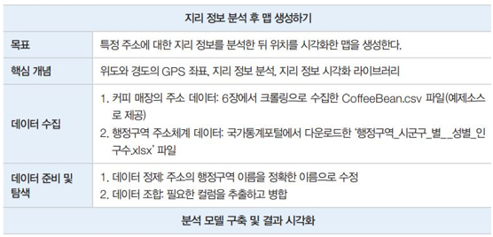
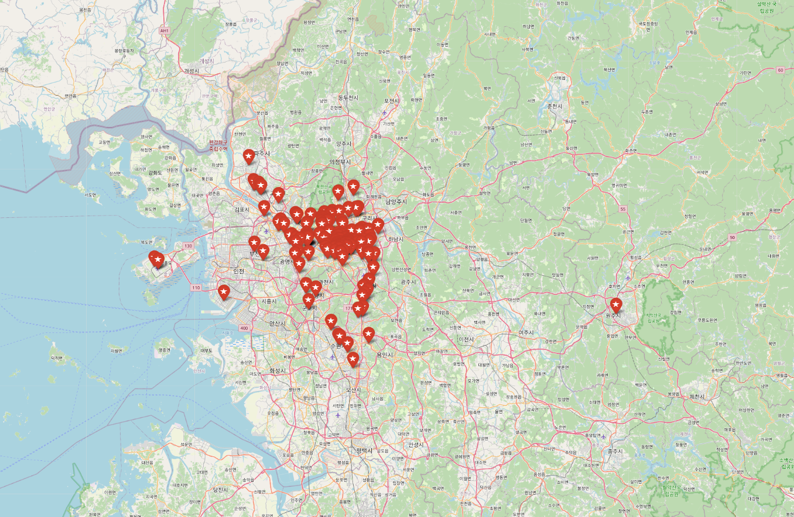
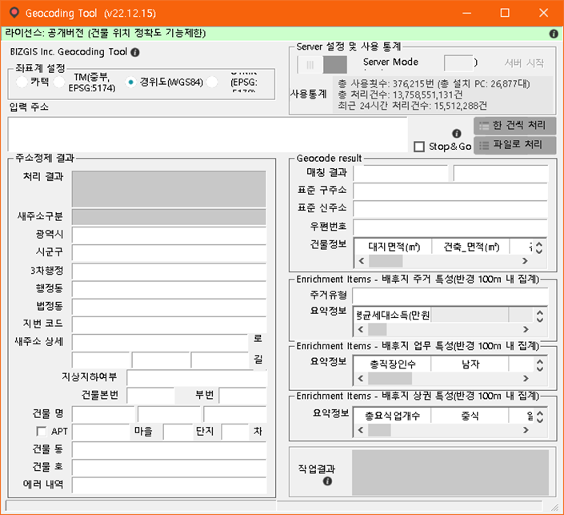

# 커피빈매장 정보 분석 후 맵 생성 
- 목표 : 커피빈 매장 주소의 지리 정보인 지오 데이터를 분석한 후 지도에 시각화하여 나타내기
- 핵심개념 : GPS 좌표 구하기, 지리정보 시각화 라이브러리
- folium, pandas 이용

## 핵심개념 이해
1. GPS 좌표 구하기
- 지오데이터 : 특정 위치의 GPS 좌표를 구해줌. 구글맵이나 네이버 지도 서비스에서 구할 수 있음
- 오픈 소프트웨어인 Geocoder-Xr을 사용해도 가능
2. 지리 정보 시각화 라이브러리
- Geodata를 지도에 시각화하려면 지리 정보 시각화 라이브러리를 사용
- folium : 지도를 html로 저장해 웹으로 볼 수 있음. 세계지도 가능.

 

## 데이터 수집
커피빈 사이트에서 동적 웹크롤링을 이용해서 얻은 위치 정보 활용

## GeocodingTool64설치
1. 주소 좌표 변환 툴 : GeocodingTool64를 사용하기 위해 설치하기
2. 압축을 풀고 폴더 안에 GeocodingTool64를 실행
3. 경위도 선택, 파일로 처리 선택 후 CoffeeBean_2. csv로 선택 
4. 주소 문자열 생성 아래 부분에 address2 선택 및 확인

