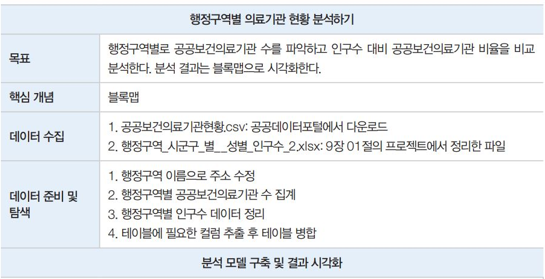
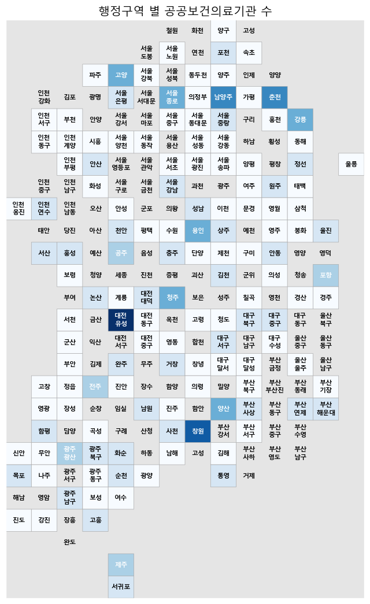
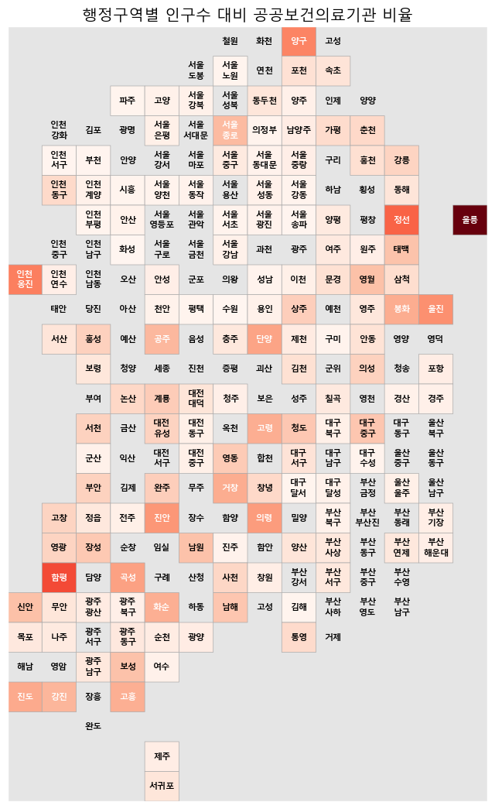
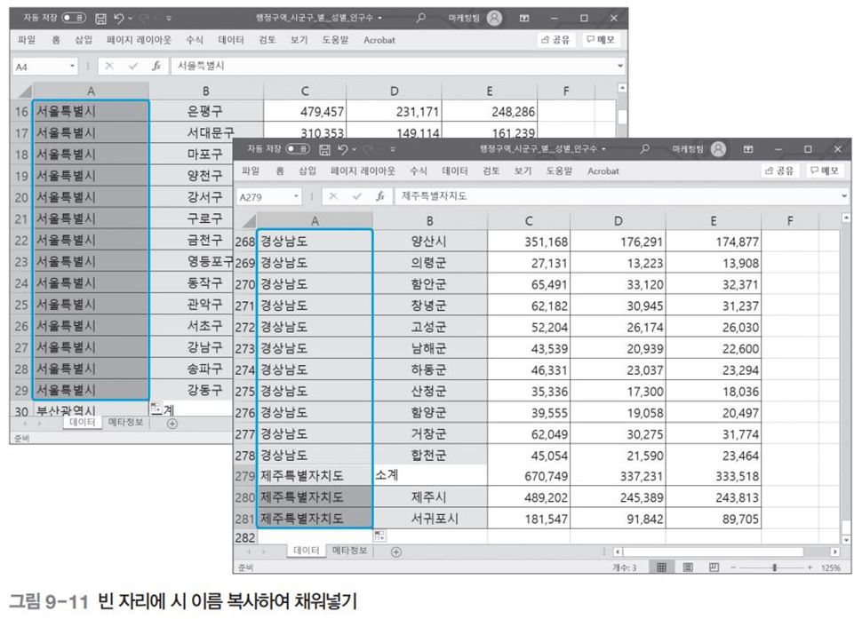

# 행정구역별 의료기관 현황 분석 
- 목표 : 행정구역별로 공공보건의료기관 수를 파악하고, 인구수 대비 공공보건의료기관 비율을 비교분석. 분석결과는 블록맵으로 시각화함
- 핵심개념 : 블록맵
    - 구역의 경계선을 단순화한 뒤 블록 형태로 그려서 지도를 나타내는 시각화 기법
    - 행정구역별 데이터 크기를 시각화할 때 많이 사용
- ggplot, matplotlib 사용

## 분석 미리보기


<br>


<br>


<br>

## 데이터 수집
### 전국 공공보건의료기관 현황 데이터
- 행정구역별 공공보건의료기관 수를 파악하고 인구수 대비 공공보건의료기관 비율을 비교 분석할 때 사용
- 공공데이터포털 사이트(www.data.go.kr)에서 다운로드
```
1. 공공데이터포털 사이트(www.data.go.kr)에서 ‘공공보건 의료기관 현황’으로 검색
2. 파일데이터 상세 페이지가 나타나면 버튼을 클릭
```

 
### 행정구역별 인구수 데이터
- 행정구역별 인구수 대비 공공보건의료기관 비율을 비교 분석할 때 사용하는 데이터
- 국가통계포털 사이트 (http://kosis.kr)에서 다운로드

```
1. 국가통계포털 사이트(http://kosis.kr)에서 ‘행정구역’으로 데이터를 검색
2. 검색 결과 중에서 ‘주민등록인구현황:행정구역(시군구)별, 성별 인구수’를 선택
3. 행정구역이 상위 레벨(시도)만 있고 하위 레벨(군구)은 보이지 않음
4. [행정구역(시군구)별] 탭을 클릭하고, [2 레벨 전체선택]을 체크해서 조회
5. [시점] 탭을 클릭하고, 시점 목록에서 2024.01을 선택한 뒤 적용을 클릭
6. 다운로드에서 파일형태를 ‘EXCEL’로 선택하고 버튼을 클릭
```
- 데이터 준비방법

```
1. 국가통계포털에서 다운로드한 ‘행정구역_시군구_별__성별_인구수.xlsx’ 파일을 열어서 확인
2. 엑셀에서 데이터 정리하기 먼저, 왼쪽에 빈 열을 삽입
3. 시 이름을 1 레벨로, 군/구 이름을 2 레벨로 옮기는 작업을 실시
     1 레벨로 분리할 시 이름을 잘라내어 A열에 붙여넣음
4. 잘라낸 시 이름 자리에 합계를 나타내는 ‘소계’를 입력
5. 엑셀의 채우기 기능을 이용해 빈 자리에 시 이름을 복사
6. 첫 번째 행을 삭제하고 열 이름을 ‘행정구역(시군구)별(1)’과 ‘행정구역(시군구)별(2)’로 변경

```
