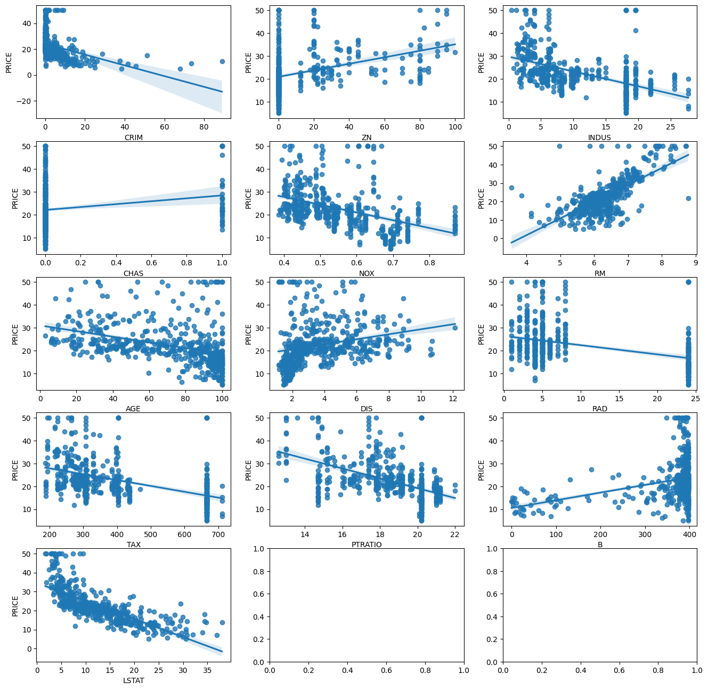
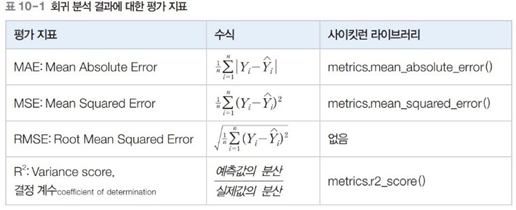

# 환경에 따른 주택 가격 예측하기
- 목표 : 보스턴 주택 가격 데이터에 머신러닝 기반의 회귀 분석을 수행. 주택 가격에 영향을 미치는 변수를 확인하고 그 값에 따른 주택 가격을 예측
- 머신러닝, 지도학습, 사이킷런, 사이킷런 내장 데이터셋, 분석평가지표

## 결과보기

## 개념 공부

### 머신러닝
- 정의 : 컴퓨터에 명시적인 프로그램 없이 스스로 학습할 수 있는 능력을 부여하는 연구분야
- 인간이 지식과 경험을 학습하는 방법을 적용하여 컴퓨터에 입력된 데이터에서 스스로 패턴을 찾아 학습하여 새로운 지식을 만들고 예측하는 통찰을 제공하는 AI의 한 분야
- 프로그램 없이?? 이 말은 회귀분석을 하는 프로그램은 있어야 하고, 전문가의 임의적인 세팅이 없이 돌아간다는 뜻.
- y=ax + b에서 a와 b를 자동으로 설정해줌

### 선형회귀
- 선형회귀(Linear Regression) : 종속변수 y와 한 개 이상의 독립변수 x와의 선형 상관관계를 모델링하는 회귀분석 기법
- 기존 데이터를 활용해 연속형 변수값을 예측 [y=ax +b]꼴의 수식을 만들고 a와 b의 값을 찾아냄
- ex: 앞으로 개봉할 영화 예상 관객수를 예측하는 문제 
- -> 실제 관객 수를 y로 표현하여 좌표평면 상에 나타냄
- 두 그래프 중 어떤 것이 기존 데이터를 잘 표현하는가, 
- 즉, 예측값이 실제값 대비 차이가 많이 나지 않는 그래프를 선택

### 분석평가지표
- 회귀 분석 결과에 대한 평가 지표는 예측값과 실제값의 차이인 오류의 크기가 됨
- 정확한 평가를 위해 오류의 절대값 평균이나 제곱의 평균, 제곱 평균의 제곱근 또는 분산 비율을 사용
- 머신러닝 프로세스에서 어느단계? 
    - OLS알고리즘은 모델구축 및 학습 
    - 분석평가지표는 모델평가단계
1. 절댓값으로 오류크기 구하기
2. 제곱으로 오류크기구하기
3. 제곱한것에 그대로 루트씌우기
4. 분산값의 비율로 구하기

