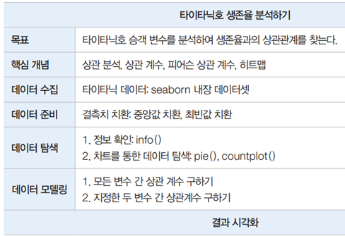

# 타이타닉호 생존율 분석하기
- 목표 : 타이타닉호 승객 변수를 분석하여 생존율과의 상관관계를 찾는다.
- 핵심개념 : 상관분석, 상관계수, 피어슨 상관계수, 히트맵
- seaborn, pandas 이용

## 분석 미리보기
- 타이타닉호의 생존자와 관련된 변수의 상관관계를 찾아봄
- 생존과 가장 상관도가 높은 변수는 무엇인지 분석
- 상관분석을 위해 피어슨 상관계수를 사용
- 변수 간의 상관관계는 시각화하여 분석
 

  
  
  
  

 

## 핵심 개념 이해
### 상관분석	
- 두 변수가 어떤 선형적 관계에 있는지를 분석하는 방법
- 두 변수는 서로 독립적이거나 상관된 관계임. 두 변수의 관계의 강도를 상관관계라고함.
- 상관분석에서는 상관관계의 정도를 나타내는 단위로 모상관계수 p를 사용
- 상관계수는 두 변수가 연관된 정도를 나타낼 뿐 인과관계를 설명하지 않으므로 정확한 예측치는 계산x

### 상관분석 vs회귀분석	
- 회귀분석 : 독립변수를 갖고 종속변수를 설명하는게 목적
- 상관분석 : 두 수량의 상호관계 또는 연관성을 결정하는 통계 측정
- 상관관계에서 종속변수와 독립변수간에 차이가 없음. 
- (x와 y간의 상관관계는 y와 x와 유사
- 회귀에서는 x에 대한 y의 회귀는, y에 대한 x의 회귀와 다름.

### 단순상관분석	
- 두 변수가 어느정도 강한 관계에 있는지 측정
### 다중상관분석	
- 세 개 이상의 변수 간 관계의 강도를 측정
- 편상관분석 : 다른 변수와의 관계를 고정하고 두 변수 간 관계의 강도를 나타내는 것

### 상관계수 p	
- 변수 간 관계의 정도(0~1)와 방향(+, -)을 하나의 수치로 요약해주는 지수로 -1에서 +1 사이의 값을 가짐
- 상관 계수가 +이면 양의 상관관계이며 한 변수가 증가하면 다른 변수도 증가
- 상관 계수가 –이면 음의 상관관계이며 한 변수가 증가할 때 다른 변수는 감소
- 0.0 ~ 0.2: 상관관계가 거의 없음	
- 0.2 ~ 0.4: 약한 상관관계가 있음	
- 0.4 ~ 0.6: 상관관계가 있음
- 0.6 ~ 0.8: 강한 상관관계가 있음	
- 0.8 ~ 1.0: 매우 강한 상관관계가 있음	

