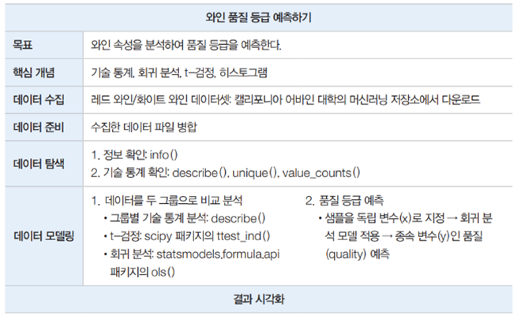
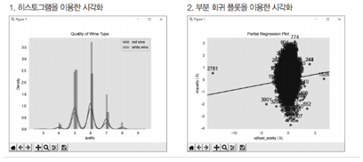

# 와인품질 예측하기
- 목표 : 와인 속성을 분석하여 품질 등급을 예측
- 핵심개념 : 기술통계, 회귀분석, t검정, 히스토그램
- matplotlib, seaborn, scipy 이용

 

### 설명
- 데이터의 기술 통계를 구함
- 레드와인과 화이트 와인 그룹의 품질에 대한 t-검정을 수행
- 와인속성을 독립변수로, 품질등급을 종속변수로 선형회귀분석을 수행

### 데이터 수집 
- 레드 와인/ 화이트 와인 데이터 셋
- 캘리포니아 어바인 대학의 머신러닝 저장소에서 다운로드

## 핵심 개념 이해

### 기술통계(요약통계)	
- 데이터의 특성을 나타내는 수치를 이용해 분석하는 기본적인 통계방법
- 평균, 중앙값, 최빈값 등을 구할 수 있음

### 회귀분석	
- 독립변수(x)와 종속변수(y)간의 상호 연관성 정도를 파악하기 위한 분석 기법
- 하나의 변수가 변함에 따라 대응되는 변수가 어떻게 변하는지를 측정하는 것
- 변수 간의 인과관계를 분석할 때 많이 사용
- 독립변수가 한 개이면 단순회귀분석, 두 개 이상이면 다중회귀분석
- 독립변수와 종속변수의 관계에 따라 선형회귀분석과 비선형회귀분석으로 나뉘어짐
- 선형 회귀분석 식 (독립변수가 여러 개인 경우) : y = b0 + b1x1 + b2x2 + ,,, + bnxn

### t-검정	
- 데이터에서 찾은 평균으로 두 그룹에 차이가 있는지 확인하는 방법
- ex) A와인의 품질이 1등급인지 2등급인지에 따라 가격에 차이가 있는지를 확인할 때 사용
- *모든 분포가 표준분포라면 평균만으로 데이터비교 가능. 하지만 각 데이터의 분산(퍼진정도)가 다 다름
- → t검정으로 분산과 평균을 수치적으로 비교하여 같다, 아니다를 검정

### 히스토그램	
- 데이터 값의 범위를 몇 개 구간으로 나누고 각 구간에 해당하는 값의 숫자나 상대적 빈도크기를 차트로 나타낸 것.
