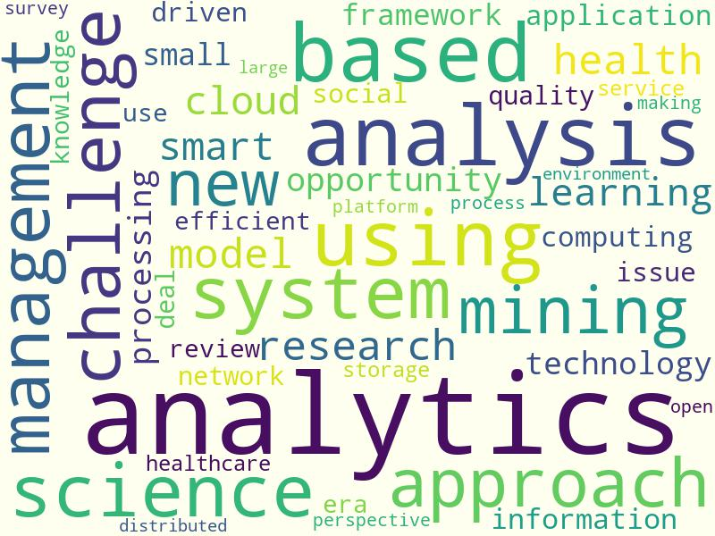
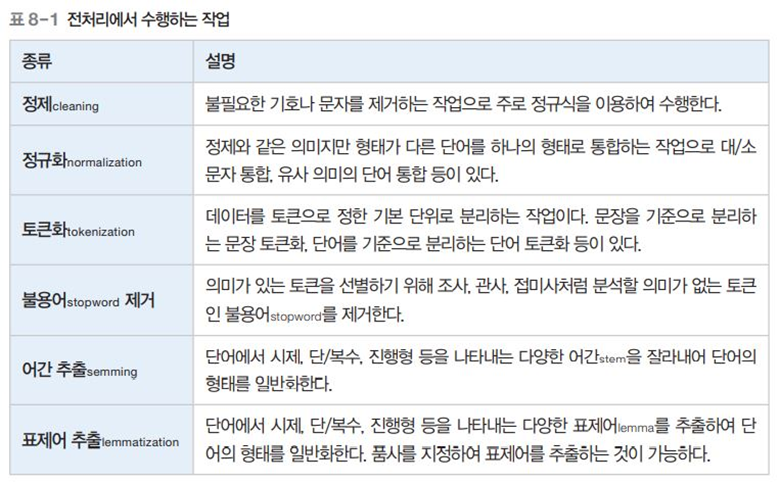
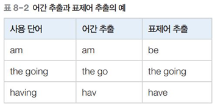
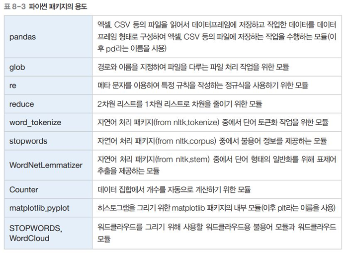

#  RISS 논문에서 명사 키워드를 분석

- 목표 : 'big data' 에 관한 RISS 논문에서 명사 키워드를 분석한다.
- 핵심개념 : 형태소 분석, 품사 태깅
- pandas, glob, nltk, matplotlib, wordcloud 이용

 

 

## 미리보기 & 목표설정
- Big Data와 관련된 키워드를 도출하여 분석
- ① 영문 데이터에서 분석할 특징을 선정
- ② 컴퓨터가 처리할 수 있는 벡터 형태로 변환
- ③ 분석 기법을 적용하여 필요한 정보를 추출

## 데이터 수집
- 데이터검색 : RISS사이트에서 ‘big data검색’ > 
- 통합검색 결과 페이지에서 [해외학술논문] 메뉴 > 
- '작성언어'를 [영어]로 선택 후 실행버튼 > 
- 검색결과 출력개수 변경하기 : 100개 후 조회클릭 > 
- 100개 전체선택 후 내보내기 : excel 형태로 > 
- 다음 페이지로 이동하여 내보내기 반복 > 
- 다운로드한 폴더 확인

## 핵심개념 이해

### 텍스트분석	
- 자연어 처리와 dataMining이 결합하여 발전된 분야로 비정형 텍스트 데이터에서 정보를 추출하여 분석하는 방법
- 단어에 대한 분석을 기본으로 함 / 텍스트 분류, 텍스트 군집화, 감성 분석 등

### 전처리
- 분석 작업의 정확도를 높이기 위해 분석에 사용할 데이터를 먼저 정리하고 변환하는 작업
 

 

### 어간추출 개념
- 한국어로 따지면 '먹다'의 '먹-', '자다'의 '자-', '지나가다'의 '지나가-', '덜그럭덜그럭하다'의 '덜그럭덜그럭하-' (어근+접미어간) 같은 것들을 말한다.
- 뒤의 '-다'는 어미를 뜻함.

### 워드 클라우드
- 텍스트 분석에서 많이 사용하는 시각화 기법
- 문서의 핵심 단어를 시각적으로 돋보이게 만들어 키워드를 직관적으로 알 수 있게 하는 것
- 출현 빈도가 높을수록 단어를 크게 나타냄
- 방대한 양의 텍스트 정보를 다루는 빅데이터 분석에서 주요 단어를 시각화하기 위해 사용

## 파이썬 패키지 용도
